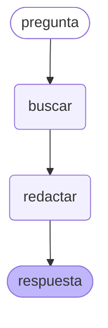
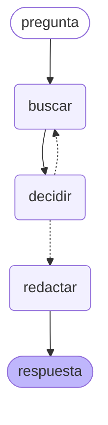
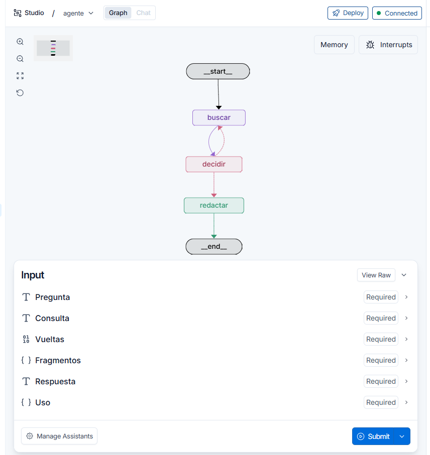

*[English](README.md) · **Español***

# RAG en Python — el mismo sistema, reconstruido en código

Reconstrucción de [mi RAG en n8n](https://github.com/andresjmnz92-jpg/rag-privado) como Python: el
agente en LangGraph, expuesto por FastAPI y por MCP, con la comparación medida entre API y modelo
local.

**El primer trabajo no era mejorarlo. Era hacerlo idéntico.** Mientras el recuperador en Python no
puntúe lo que este corpus ya puntúa, cualquier comparación posterior entre los dos agentes estaría
midiendo el port en vez del agente.

**Stack:** PostgreSQL 17 + pgvector · Ollama con BGE-M3 · psycopg · `gpt-5-mini`

---

## Semana 1: el recuperador, portado y verificado

Las mismas 16 preguntas, el mismo corpus de 581 fragmentos, el mismo modelo de embeddings, la
misma tabla que consulta el chat de n8n en vivo. Los números de referencia se midieron el 10 de
agosto; los de Python el 11.

| | Referencia | **Python** |
| --- | --- | --- |
| Recall@10 | 16/16 | **16/16** |
| MRR@10 | 0,938 | **0,938** |
| En puesto 1 | 14/16 | **14/16** |

Idénticos hasta el tercer decimal. El port no es una reescritura que casualmente funciona:
recupera los mismos fragmentos en el mismo orden.

**Vale la pena ser preciso sobre qué se compara aquí.** Los dos números salen de consultar la
misma tabla directamente; ninguno pasa por una ejecución de n8n, porque la calidad de la
recuperación es una propiedad del corpus y del modelo de embeddings, no de la herramienta que los
llama. La comparación n8n contra LangGraph es sobre el **agente**, y esa cae en la semana 2.

**Para qué sirve:** cuando esa comparación llegue, el recuperador ya no será una variable.

### Toda la búsqueda es una línea de SQL

```sql
SELECT metadata->>'seccion' FROM documentos_v3
ORDER BY embedding <=> %s::vector LIMIT 10
```

`<=>` es el operador de distancia coseno de pgvector. No hay base de datos vectorial, ni
framework, ni librería de recuperación: 25 líneas de `psycopg` y `requests` reemplazan los nodos
de n8n.

---

## Semana 2: el agente, y una métrica que mentía

El agente son dos nodos y una flecha: `buscar → redactar`. Las cinco reglas del system prompt
están copiadas del workflow de n8n palabra por palabra — cambiarlas convertiría una comparación
de frameworks en una comparación de prompts.



*Ese diagrama no está dibujado a mano: lo emite `agente.get_graph().draw_mermaid()` desde el grafo
compilado. La documentación que no puede desfasarse del código es la única que sobrevive.*

**Una de esas reglas deja de ser una regla aquí.** La número 1 le pide al modelo que SIEMPRE
busque antes de responder. En n8n eso es una petición que el modelo puede ignorar. En un grafo,
`START → buscar → redactar` significa que el redactor no puede ejecutarse sin fragmentos
recuperados. **La misma instrucción pasa de súplica a estructura**, y esa diferencia solo se vio
construyendo las dos.

### Los puntajes

20 preguntas con respuestas verificadas a mano, bajo la regla estricta: una cita equivocada es un
fallo aunque el contenido sea correcto.

| | corpus v3 | **corpus v4** |
| --- | --- | --- |
| Citó la sección correcta | 14/16 | **15–16/16** |
| Contenido correcto | 14/16 | **15/16** |
| Controles (callarse es lo correcto) | 4/4 | **4/4** |
| **Total** | **17/20** | **19/20** |
| Costo de las 20 | $0,028–0,029 | **$0,027–0,030** |

**Los rangos no son una evasiva: son la medición.** v4 se corrió dos veces y dio 16/16 y 15/16 en
citas. La misma tabla, el mismo modelo, el mismo prompt. Publicar un número solo habría dado a
entender una precisión que esto no tiene.

Lo que la segunda corrida separa limpiamente:

- **La 9 falla en todas las corridas de v3 y acierta en todas las de v4.** Eso no es ruido: es el
  fragmento pasando del puesto 63 al 2, y los puestos son deterministas.
- **La 8 cambia entre corridas en los dos corpus.** Es la única pregunta inestable, y es la única
  con tres secciones esperadas; el modelo se va a § 164.304 (*Definitions* de la Security Rule),
  que está semánticamente pegada a las tres.

### El hallazgo: recall@10 reportaba 100% sobre un sistema que entregaba 81%

Tres de los cuatro fallos tenían la misma causa, y la métrica no podía ver ninguno.

`recall@10` pregunta *¿volvió la sección correcta?* — y volvía. Lo que no puede preguntar es si
volvió el **fragmento que contiene la respuesta**. Una sección partida en 17 fragmentos puede
llegar cuatro veces sin la frase que responde.

Medido fragmento por fragmento:

| Pregunta | Puesto real del fragmento que responde |
| --- | --- |
| Plazo de acceso (§ 164.524) | **63** de 581 |
| Factores de la multa (§ 160.408) | **26** — seis puestos fuera de la ventana |
| Business associate (§ 160.103) | **151** |

El sistema se negó a responder la del plazo de acceso. Y era lo correcto: la frase de los 30 días
nunca estuvo delante. **El redactor no era el cuello de botella; la métrica apuntaba a la mitad
equivocada.**

### El experimento rechazado se rechazó con evidencia mala

Una versión anterior del corpus —`v4`, que le pone el encabezado de la sección a cada fragmento—
se había medido y **descartado**: subía el MRR de 0,938 a 0,969, "una pregunta de dieciséis", a
cambio de 4% más de fichas de entrada para siempre.

Esa decisión usó la métrica por sección. Vuelta a medir contra el fragmento que responde:

| Pregunta | v3 | **v4** |
| --- | --- | --- |
| Plazo de acceso | 63 | **2** |
| Factores de la multa | 26 | **2** |
| Business associate | 151 | 95 — sigue fuera |

Funciona por un motivo concreto. El fragmento con el plazo de acceso empieza en *"(2) Timely
action by the covered entity"* — no dice "acceso" ni "información de salud" en ninguna parte. Con
`§ 164.524 Access of individuals to protected health information` pegado delante, el vector sabe
de qué trata.

**Las dos preguntas que saltaron al puesto 2 son exactamente las dos que se arreglaron.** Y el
argumento del 4% corría al revés: v4 costó **menos** en total, porque una respuesta precisa es
una respuesta más corta.

El rechazo fue una decisión sólida tomada sobre una medición que no podía ver el defecto. Esa es
la lección más útil de todo esto: **un experimento vale lo que valga la métrica que lo juzgó.**

### Quién calificó qué

Los controles se califican solos: su respuesta correcta es una frase exacta. Los 16 juicios de
contenido salieron de leer cada respuesta contra la verificada a mano; Claude hizo el primer pase
y señaló los casos ambiguos, y esos los decidí yo. Tres eran genuinamente discutibles, y en uno
fallé en contra de su lectura. **Eso no es evaluación independiente y el repo no debe fingir que
lo es** — es un camino más rápido a la misma lectura, con los desacuerdos anotados.

---

## Semana 2b: el ciclo, medido y rechazado

Un grafo de dos cajas y una flecha no usa nada de LangGraph — el framework existe por los ciclos.
Así que el agente pasó a tener tres nodos y un camino que vuelve: `buscar → decidir → buscar`.



`decidir` lee la pregunta y los 20 fragmentos y devuelve una de dos cosas: `SUFICIENTE`, o una
consulta de búsqueda nueva escrita con el vocabulario que acaba de leer. Tope de 5 vueltas, el
mismo `maxIterations` del agente de n8n. **El prompt del redactor no se tocó**: si el puntaje se
movía, se movía por el ciclo.



*LangGraph Studio conectado a un servidor local (`langgraph dev`), con el trazado a LangSmith
apagado. Cada nodo se puede abrir para ver qué entró y qué salió — los 20 fragmentos, la consulta
que escribió el juez, el contexto que recibió el redactor.*

### El resultado

| | lineal | **con ciclo** |
| --- | --- | --- |
| Contenido correcto | 15/16 | **15/16** |
| Controles | 4/4 | **4/4** |
| **Total** | **19/20** | **19/20** |
| Segundos por consulta | 16,0 | **33,9** |
| Fichas de entrada, las 20 | 77.446 | **303.099** |
| Costo de las 20 | $0,030 | **$0,081** |

Las citas subieron de 15/16 a 16/16, y no cuenta: la única que cambió es la 8, que este repo ya
tenía documentada como la pregunta inestable entre corridas.

**El ciclo no giró ni una vez en las 16 preguntas que tienen respuesta.** Se ve en las fichas —
todas gastaron unas 7.400 de entrada, que son exactamente dos llamadas: juez y redactor, una
vuelta. Los cuatro controles gastaron unas 46.000 cada uno, las cinco vueltas completas. **El 61%
del gasto se fue en las cuatro preguntas cuya respuesta correcta era negarse.** El juez cobra en
las veinte y solo hace girar el ciclo donde no hay nada que encontrar.

### Por qué, y es más útil que el puntaje

El ciclo se diseñó mirando una pregunta concreta: la 9, que el agente de n8n acertaba y el grafo
lineal fallaba. La traza mostraba dos búsquedas, y la primera le enseñaba el vocabulario a la
segunda. Pero **eso se midió sobre el corpus v3**, donde el fragmento con la respuesta estaba en
el puesto 63. Con v4 llega en el puesto 2.

**Arreglar los datos volvió innecesaria la arquitectura.** El ciclo y un corpus bien preparado no
se suman: se sustituyen. El ciclo compensa una preparación mala, y se sigue pagando después de
arreglarla.

### El umbral que tampoco funcionó

Si el ciclo solo desperdicia fichas en las preguntas sin respuesta, la idea obvia es no llamar al
juez cuando ni el mejor fragmento se parece a la pregunta. La distancia coseno ya la calcula
Postgres al ordenar; sale gratis. Medida sobre las 20:

| | distancia del mejor fragmento |
| --- | --- |
| 16 preguntas con respuesta | 0,287 – **0,497** |
| 4 controles | **0,477** – 0,548 |

**Se solapan.** Un umbral en 0,47 cortaría los cuatro controles y también la pregunta 8, que sí
tiene respuesta: 19/20 pasaría a 18/20. La distancia mide qué tan raro suena lo que preguntas, no
si la respuesta está.

### Y aun así el ciclo se queda en el repo

No porque mejore el puntaje —no lo mejora— sino porque el sistema que este repo describe ahora es
el que tiene. El experimento con su tabla vale más que el código borrado: **un resultado negativo
solo enseña si se publica.**

---

## Semana 3a: cuánto aguanta esto

Este sistema tiene 581 fragmentos y no tiene índice vectorial. La pregunta no es cuánto tarda —
tarda 5 ms— sino **a partir de qué tamaño hace falta un índice, y qué cuesta tenerlo.**

El corpus real no cambia: reescribir el golden dataset sobre un millón de documentos cuesta
semanas de criterio experto y se perdería lo único que permitió encontrar los hallazgos de la
semana 2. El volumen se genera; **las consultas siguen siendo las 16 preguntas reales.**

Medido en el servidor, en un contenedor aparte con límite de memoria: el chat público vive en esa
misma máquina y un benchmark no puede tumbarlo. ([`benchmark/escala.sql`](benchmark/escala.sql))

| vectores | tabla | sin índice | con índice | recall@10 | construir el índice | ocupa |
| --- | --- | --- | --- | --- | --- | --- |
| **581** (los reales) | 3,3 MB | **4,8 ms** | — | — | — | — |
| **10.000** | 54 MB | **111 ms** | **1,2 ms** | **1,000** | 6 s | 78 MB |
| **100.000** | 535 MB | **1.472 ms** | **5,3 ms** | **1,000** | 84 s | **781 MB** |

Sin índice el tiempo sigue al número de filas: diecisiete veces más datos, veintitrés veces más
lento. Con índice, diez veces más datos son cuatro veces más lento. **El índice no cuesta
precisión en este corpus — cuesta espacio: 781 MB de índice para 535 MB de datos.**

**Con 581 vectores el índice no hacía falta, y ahora eso es un número en vez de una excusa:**
habría sido añadir 78 MB para ahorrar 3 milisegundos.

### Lo que se proyecta y lo que no

Un escaneo secuencial es lineal por definición, así que la búsqueda sin índice y el
almacenamiento se calculan. **Esto es aritmética sobre la fila medida, no medición:**

| | tabla | índice | sin índice |
| --- | --- | --- | --- |
| 1.000.000 | 5,4 GB | 7,8 GB | ~15 s |
| 10.000.000 | 54 GB | 78 GB | ~2,5 min |
| 100.000.000 | 535 GB | 781 GB | ~25 min |

**La búsqueda *con* índice no se proyecta, y ahí está lo que importa.** HNSW es rápido mientras el
grafo quepa en memoria; cuando no cabe, cada salto del grafo pasa de leer RAM a leer disco al
azar, y eso no es "más lento" sino otro régimen. El mismo quiebre se vio hoy al construirlo:
pgvector avisa —`hnsw graph no longer fits into maintenance_work_mem`— y tarda más del doble.

Ese punto sí se calcula con lo medido. **El índice pesa 7,81 KB por vector.** Con 6,1 GB de RAM
disponible en este servidor, deja de caber alrededor de los **780.000 vectores**. Y el disco entero
son 38 GB, así que a diez millones no cabe ni la tabla.

### Los dos fallos que no dieron ningún error

**El generador de datos rompió el experimento en silencio.** El primer relleno usaba una
subconsulta lateral que no dependía de la fila, así que Postgres la evaluó una vez y reutilizó el
mismo ruido: 100.000 filas que eran unos 1.700 vectores distintos. Cero errores, cero avisos,
tamaño plausible, índice construido, consultas rápidas. Lo delató un recall de **0,063** — un
número tan absurdo que obligó a mirar. Con 0,85 se habría publicado.

**Un índice sobre una tabla hinchada rinde peor que ningún índice.** Al bajar de 100.000 a 10.000
filas, `VACUUM` normal no devuelve el espacio: la tabla seguía ocupando 586 MB con 10.000 filas, y
el mismo índice tardaba **125 ms por consulta**. Tras `VACUUM FULL`: **1,2 ms**. Cien veces, sin
tocar el índice.

### Lo que este montaje no puede decir

Los 100.000 vectores son copias con ruido de 581 originales, así que tienen 581 vecindarios; un
corpus real de ese tamaño tendría mucha más variedad temática. **El recall de 1,000 es optimista
por eso.** La latencia y el tamaño no dependen de la distribución y se sostienen; el recall a
escala, medido sobre datos reales, sigue sin conocerse.

---

## Semana 3b: dos fachadas, un solo motor

Hasta aquí el sistema solo funcionaba ejecutando Python a mano. Ahora tiene dos puertas, y ninguna
de las dos toca el motor.

```
recuperar.py            agente.py
  buscar_fragmentos()     agente.invoke()
        ↑         ↖            ↑
     api.py            mcp_server.py
    (FastAPI)             (stdio)
```

**Las dos importan las funciones directamente.** El MCP no llama a la API por HTTP: son consumidores
hermanos del mismo módulo, no una cadena. Si el motor cambia, cambian los dos, y no hay una red en
medio que pueda caerse.

### La API

| Ruta | Devuelve | Costo |
| --- | --- | --- |
| `GET /health` | el estado de Postgres y de Ollama **por separado** | $0 |
| `POST /v1/buscar` | los fragmentos con su sección y su cita | $0 |
| `POST /v1/preguntar` | respuesta, fragmentos, vueltas del ciclo y fichas gastadas | ~$0,004 |

**Están separadas a propósito.** `/v1/buscar` es determinista, instantáneo y gratis; `/v1/preguntar`
es no determinista, lento y cuesta dinero. Medir las dos mitades por separado fue lo que encontró el
fallo de la semana 2, y esta es esa lección puesta en la arquitectura: **saber si la base de datos
responde no debería costar una llamada a un LLM.**

`/health` hace una consulta real a Postgres y un embedding real contra Ollama. Devolver `{"status":
"ok"}` a secas es justo el fallo que este proyecto ya pisó dos veces.

### El MCP expone una herramienta, no dos

`buscar_hipaa(pregunta, limite=20)`. **No expone `preguntar`, y es una decisión.** Al otro lado del
MCP está Claude, que ya redacta; ofrecerle `preguntar` sería pagar `gpt-5-mini` para escribir algo
que el modelo del otro lado iba a escribir igual, y meter un redactor peor en medio. **La
herramienta que se le ofrece a un modelo es la que él no puede hacer solo: buscar en un corpus
privado.**

La descripción de la herramienta incluye una línea que parece de más y no lo es — *"la pregunta
puede venir en español, NO hay que traducirla"*. Sin ella, un modelo servicial traduce al inglés
antes de llamar y rompe exactamente lo que hace especial a este sistema.

### Los dos fallos que encontró construir esto

**`psycopg` no tenía límite de tiempo.** Con el túnel caído, `/health` no devolvía un error: se
quedaba colgado **más de 130 segundos**. Un chequeo de salud que se cuelga se lee como "lento" en
vez de "caído", que es la peor de las dos lecturas. Y no era de la API: **cualquier script de este
repo se colgaba igual** desde la semana 1, y nunca se vio porque el túnel nunca se cayó mientras
algo corría. Con `connect_timeout=5`: **503 en 7 segundos, diciendo cuál de los dos falló.**

**`load_dotenv()` buscaba el `.env` en el directorio actual.** El servidor MCP lo arranca Claude
desde su propia carpeta, así que habría fallado en el primer arranque con un `KeyError`. Se arregla
con una ruta absoluta relativa al archivo.

Ninguno de los dos dio error mientras se construía. Aparecieron al **probar el sistema roto a
propósito**, que es la misma prueba que se le hizo al vigilante del servidor.

### Las pruebas

Cuatro, con el `TestClient` de FastAPI, en 7 segundos y **sin llamar a OpenAI**: salud, pregunta
vacía (422), límite fuera de rango (422), y una búsqueda real comprobando que cada fragmento trae
texto, sección y cita.

`/v1/preguntar` **no se prueba automáticamente**: cada corrida gastaría dinero. Se prueba a mano
desde `/docs`, y queda escrito que es así.

Diseño completo, con lo que se dejó fuera y por qué:
[`docs/2026-08-12-api-y-mcp-diseno.md`](docs/2026-08-12-api-y-mcp-diseno.md).

---

## Cómo se corre

Postgres y Ollama corren en Docker en el servidor y no publican puertos, así que un túnel SSH
llega a ellos sin abrir nada hacia internet:

```bash
ssh -i <llave> -N -L 5433:<ip-contenedor-postgres>:5432 -L 11435:<ip-contenedor-ollama>:11434 <usuario>@<host>
```

Después, con `POSTGRES_USER`, `POSTGRES_PASSWORD` y `POSTGRES_DB` en un `.env` local:

```bash
python -m venv .venv && .venv/Scripts/activate
pip install "psycopg[binary]" requests python-dotenv
python recuperar.py
```

Esas IP de contenedor las asigna Docker y cambian cuando los contenedores se reinician.
`docker inspect` da las vigentes.

---

## El valor por defecto que nadie midió

`topK = 20` venía del chat de n8n y entró al port sin que nadie lo cuestionara. Con el corpus v4
el fragmento que responde llega en el puesto 2 — o sea que dieciocho fragmentos se pagan en cada
consulta, sin haber comprobado qué compran.

Mismo corpus, mismo prompt, las mismas 20 preguntas. Solo cambió `TOP_K`:

| | topK 20 | **topK 5** |
| --- | --- | --- |
| Controles (automático) | 4/4 | **4/4** |
| Citó la sección esperada (automático) | 16/16 | **16/16** |
| Fichas de entrada, las 20 | 303.099 | **88.192** |
| Fichas de salida | 41.738 | **45.336** |
| Costo de las 20 | $0,081 | **$0,057** |
| Segundos por consulta | 33,9 | **27,5** |

**3,4 veces menos entrada para el mismo puntaje automático** — y la salida *subió*. Con menos
contexto el modelo escribe respuestas algo más largas. El ahorro es real; decir "todo mejoró"
sería mentira.

**Se declara en vez de esconderse: la columna de contenido no se calificó en esta corrida.** Las
dos medidas automáticas son una prueba de subcadena — si apareció el número de sección esperado,
si apareció la frase de negativa. Saber si las dieciséis respuestas siguen diciendo lo correcto
exige que un humano las lea, y nadie lo ha hecho. Esta tabla sostiene "el puntaje automático no se
movió". No sostiene "la calidad se mantuvo".

**Y cambia lo que la semana 4 tiene que vigilar.** El contexto por defecto de Ollama es de 4.096
fichas y trunca lo que pase de ahí sin decir nada. Las 16 preguntas con respuesta gastan hoy entre
1.731 y 2.429 fichas de entrada: todas caben. Los cuatro controles gastan entre 10.006 y 19.719 —
ninguno cabe, porque son las únicas preguntas donde el ciclo gira de verdad y acumula fragmentos.
Un modelo local medido con el contexto por defecto se vería bien en las dieciséis y fallaría
callado en las cuatro.

**Adoptado: `TOP_K` vale 5 por defecto.** El valor que eligió la medición es con el que corre el
sistema — un repo cuyo README publica un número mientras su código corre otro es peor que no haber
medido. La variable de entorno se queda solo mientras la semana 4 tenga que correr las dos.

---

## Semana 4: cuánto cuesta la privacidad, en número

Dos variables de entorno, y el redactor es lo único que cambia: `MODELO` elige el modelo y
`MODELO_URL` apunta a Ollama, que habla el protocolo de OpenAI. `buscar`, el corpus y el prompt no
se tocan. **Era la prueba del propio diseño y la pasó**: si cambiar la nube por un modelo local
hubiera costado más de dos variables, la arquitectura estaba mal.

El ciclo está apagado en **las dos** corridas (`MAX_VUELTAS=1`). Ya está medido como inútil (#4), y
es lo único que infla los cuatro controles a 19.719 fichas de entrada — que no caben en 6 GB de
VRAM. La condición se mantiene: solo cambia quién redacta.

### El resultado

Medido en una GTX 1660 Ti, 6 GB, Windows con el escritorio corriendo.

| | `gpt-5-mini` | **`qwen3:4b` local** |
| --- | --- | --- |
| Contenido correcto | 13/16 | **9/16** |
| Controles | 4/4 | **4/4** |
| **Total** | **17/20** | **13/20** |
| Segundos por consulta | 18,7 | **89,2** |
| Fichas de salida, las 20 | 24.769 | **84.750** |
| Costo de las 20 | $0,031 | **$0,000** |

**El modelo local se negó en las cuatro trampas.** Ni multa del GDPR, ni certificación HIPAA, ni
obligación colombiana, ni cláusula de IA. Un modelo de 2,5 GB en una tarjeta de consumo aguantó la
línea que más importa en un corpus normativo.

### El hallazgo que el puntaje no puede mostrar

La pregunta 14 pide los cinco elementos que debe contener una notificación de brecha. **Los dos
modelos dieron cuatro.**

- **`gpt-5-mini` rellenó el quinto con texto de otra sección** — el § 164.410, que regula lo que un
  *business associate* le reporta a la entidad cubierta, no lo que se le dice al individuo.
- **`qwen3:4b` dio cuatro y se detuvo.**

La comprobación automática puntúa las dos igual. Bajo una mirada de cumplimiento no se parecen en
nada: **un elemento que falta es un hueco que se puede encontrar; uno fabricado es un hueco que
parece lleno.**

### Dónde falló cada uno de verdad

- **La pregunta 6 falla en los dos, idéntica** — la definición de *business associate*. Su fragmento
  con la respuesta está en el puesto 95 incluso con v4. Eso es un fallo de recuperación, no del
  redactor, y no lo arregla cambiar de modelo.
- **`gpt-5-mini`** perdió además la 15: devolvió seis de los ocho elementos obligatorios del aviso
  de privacidad.
- **`qwen3:4b`** revolvió los niveles de multa en la 12 — *"menos de $1.000 o más de $50.000 por
  violación"* no se puede leer. Esa sola respuesta costó 177,9 segundos y 8.411 fichas de salida, lo
  peor de las veinte. Y se dejó matices en otras: *"más de 500 individuos"* donde la norma dice
  *"500 residentes de un estado"*, y los plazos de 30 y 60 días pelados, sin la prórroga única que
  los dos permiten.

### Dos costos que no son el puntaje

**84.750 fichas de salida contra 24.769**, para respuestas que muchas veces son de seis palabras.
qwen3 razona largo y contesta corto, y ese razonamiento se cobra como salida. Es también la razón de
haber subido el contexto: una sola consulta de prueba gastó 2.266 + 2.449 = **4.715 fichas**, y el
valor por defecto de Ollama, 4.096, **trunca lo que pase de ahí sin decir nada**. Medido con el
valor por defecto, un modelo local se vería bien en las dieciséis y fallaría callado en las cuatro.

**89,2 segundos contra 18,7.** Gratis no es gratis: se paga en tiempo.

### Lo que esta tabla NO afirma

- **Estas dos columnas se comparan entre sí, no con el 19/20 publicado en la semana 2.** Entre
  aquella medición y esta cambiaron **dos cosas a la vez** — se quitó el ciclo *y* se endureció el
  criterio de calificación — así que atribuir la diferencia a cualquiera de las dos repetiría el
  error exacto que este repo se pasó tres semanas encontrando.
- **El criterio, escrito para que se pueda discutir:** estricto. Un elemento que falta de una lista
  obligatoria, o un matiz omitido que cambia el sentido legal, cuenta como fallo.
- **Quién calificó:** los cuatro controles se califican solos con una frase exacta. Las 16 respuestas
  de contenido las leyó Claude en primer pase, con Andrés fijando el criterio. **Eso no es
  evaluación independiente**: el mismo sistema que ayudó a construir esto también lo calificó.
- Una corrida de cada uno. Ninguno de los dos modelos es determinista.
- **Windows con escritorio cuesta ~1,3 GB de VRAM** que un servidor Linux sin entorno gráfico no
  paga, y los 89,2 segundos describen esta tarjeta, no hardware de servidor.

### El techo de VRAM, medido

| `num_ctx` | tamaño del modelo | dónde corre |
| --- | --- | --- |
| 4.096 | 3,2 GB | 100% GPU |
| 8.192 | 3,9 GB | **100% GPU** |
| 16.384 | 5,4 GB | 21% CPU / 79% GPU |
| 24.576 | 6,7 GB | 37% CPU / 63% GPU |

**8.192 es el techo con 6 GB.** Pasado eso el modelo se parte y la latencia deja de describir a una
GPU. Estas corridas usaron 8.192, verificado al 100% en GPU en las veinte consultas.

---

## Qué sigue

1. **Una métrica de recuperación que mida el fragmento, no la sección.** La actual reportaba 16/16
   mientras tres respuestas no estaban en lo que llegó al modelo. Todo lo demás depende de
   arreglar eso.
2. **El fallo que queda, § 160.103.** Su fragmento con la respuesta está en el puesto 95 incluso
   con v4, y empieza en *"(i) On behalf of such covered entity"* — las palabras "business
   associate" no aparecen por ningún lado. La recuperación sola puede no alcanzarlo; devolver la
   sección entera cuando un fragmento suyo entra al top es el candidato obvio, y cuesta 4,6 veces
   más fichas, así que se mide antes de adoptarlo.
3. **El ciclo contra el corpus v3.** Si la hipótesis es que el ciclo compensa una preparación
   mala, correrlo sobre v3 —que se conserva a propósito— debería subir el 17/20 que dio ahí el
   flujo lineal. Es la casilla que falta de una tabla de cuatro.
4. **Desplegar con Docker, y medir `gpt-5-mini` contra un modelo local.** Esa comparación es el
   argumento de privacidad con un número en vez de una promesa.
5. **El evaluador en CI.** Que cada cambio corra las 20 preguntas y avise si el puntaje baja, en vez
   de acordarse de correrlas a mano.

**Sigue abierto, y se dice en vez de esconderse:** estos números son una corrida de cada uno. El
modelo no es determinista, y dos preguntas de dieciséis no sobrevivirían a una prueba pareada. Lo
que sostiene el argumento es el mecanismo — los puestos se midieron ANTES de volver a correr
ninguna pregunta, y las dos que mejoraron son exactamente las dos que los puestos predijeron.

**Todavía sin comparar:** n8n contra LangGraph en calidad de respuesta. El puntaje publicado de
n8n se midió sobre el corpus v2, y meterlo en la misma tabla que un número de v3/v4 repetiría el
error que esta semana se gastó en encontrar.
