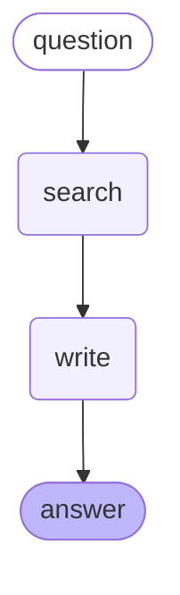

***English** · [Español](README.es.md)*

# RAG in Python — the same system, rebuilt in code

Rebuilding [my n8n RAG](https://github.com/andresjmnz92-jpg/rag-privado) as Python: the agent in
LangGraph, exposed through FastAPI and MCP, with the API-versus-local-model comparison measured.

**The first job was not to make it better. It was to make it identical.** Until the Python
retriever scores what this corpus already scores, any later comparison between the two agents
would be measuring the port instead of the agent.

**Stack:** PostgreSQL 17 + pgvector · Ollama with BGE-M3 · psycopg · `gpt-5-mini`

---

## Week 1: the retriever, ported and verified

Same 16 questions, same corpus of 581 chunks, same embedding model, same table the live n8n chat
queries. The reference numbers were measured on 10 August; the Python ones on 11 August.

| | Reference | **Python** |
| --- | --- | --- |
| Recall@10 | 16/16 | **16/16** |
| MRR@10 | 0.938 | **0.938** |
| Rank 1 | 14/16 | **14/16** |

Identical, to three decimals. The port is not a rewrite that happens to work — it retrieves the
same chunks in the same order.

**Worth being precise about what this compares.** Both numbers come from querying the same table
directly; neither goes through an n8n execution, because retrieval quality is a property of the
corpus and the embedding model, not of the tool that calls them. The n8n-versus-LangGraph
comparison is about the **agent**, and it lands in week 2.

**What that buys:** when that comparison happens, the retriever is no longer a variable.

### The whole search is one line of SQL

```sql
SELECT metadata->>'seccion' FROM documentos_v3
ORDER BY embedding <=> %s::vector LIMIT 10
```

`<=>` is pgvector's cosine distance operator. There is no vector database, no framework, and no
retrieval library involved — 25 lines of `psycopg` and `requests` replace the n8n nodes.

---

## Week 2: the agent, and a metric that was lying

The agent is two nodes and one edge: `search → write`. The five system-prompt rules are copied
from the n8n workflow word for word — changing them would turn a framework comparison into a
prompt comparison.



*That diagram is not drawn by hand: `agente.get_graph().draw_mermaid()` emits it from the compiled
graph. Documentation that cannot drift from the code is the only kind that survives.*

**One of those rules stops being a rule here.** Rule 1 tells the model to *always* search before
answering. In n8n that is a request the model is free to ignore. In a graph, `START → search →
write` means the writer cannot run without retrieved chunks. **The same instruction moves from
plea to structure**, and that difference only became visible by building both.

### The scores

20 questions, hand-verified answers, scored under the strict rule: a wrong citation is a failure
even when the content is right.

| | corpus v3 | **corpus v4** |
| --- | --- | --- |
| Cited the right section | 14/16 | **15–16/16** |
| Content correct | 14/16 | **15/16** |
| Controls (silence is correct) | 4/4 | **4/4** |
| **Total** | **17/20** | **19/20** |
| Cost of all 20 | $0.028–0.029 | **$0.027–0.030** |

**The ranges are not hedging — they are the measurement.** v4 was run twice and scored 16/16 and
15/16 on citations. Same table, same model, same prompt. Reporting a single number would have
implied a precision this does not have.

What the repeat run separates cleanly:

- **Q9 fails in every v3 run and passes in every v4 run.** That is not noise — it is the chunk
  moving from rank 63 to rank 2, and ranks are deterministic.
- **Q8 flips between runs in both corpora.** It is the only unstable question, and it is the only
  one with three expected sections; the model reaches for § 164.304 (*Definitions* of the Security
  Rule), which sits semantically next to all three.

### The finding: recall@10 was reporting 100% on a system delivering 81%

Three of the four failures had the same cause, and the metric could not see any of them.

`recall@10` asks *did the right section come back?* — and it did. What it cannot ask is whether
the chunk carrying the answer came back. A section split across 17 chunks can arrive four times
without the sentence that answers the question.

Measured, chunk by chunk:

| Question | Where the answering chunk actually ranked |
| --- | --- |
| Access deadline (§ 164.524) | **63** of 581 |
| Penalty factors (§ 160.408) | **26** — six places outside the window |
| Business associate (§ 160.103) | **151** |

The system refused to answer the access-deadline question. That was the correct behaviour: the
30-day sentence was never in front of it. **The writer was not the bottleneck; the metric was
pointing at the wrong half.**

### The rejected experiment was rejected on bad evidence

An earlier corpus version — `v4`, which prefixes every chunk with its section heading — had been
measured and **turned down**: it moved MRR from 0.938 to 0.969, "one question in sixteen", at 4%
more input tokens forever.

That decision used the section-level metric. Re-measured against the chunk that answers:

| Question | v3 | **v4** |
| --- | --- | --- |
| Access deadline | 63 | **2** |
| Penalty factors | 26 | **2** |
| Business associate | 151 | 95 — still outside |

It works for a concrete reason. The chunk holding the access deadline opens with *"(2) Timely
action by the covered entity"* — it never says "access" or "health information". Prefixed with
`§ 164.524 Access of individuals to protected health information`, the vector knows what it is
about.

**Both questions that jumped to rank 2 are the two that got fixed.** And the 4% token argument
ran backwards: v4 cost **less** overall, because a precise answer is a shorter answer.

The rejection was a sound decision made on a measurement that could not see the defect. That is
the more useful lesson than any score here: **an experiment is only as good as the metric that
judged it.**

### Who scored what

The controls score themselves — their correct answer is one exact sentence. The 16 content
judgements were made by reading each answer against the hand-verified one; Claude did the first
pass and flagged the ambiguous cases, and I decided those. Three were genuinely arguable, and one
of them I overruled. **That is not independent evaluation and the repo should not pretend it is** —
it is a faster path to the same reading, with the disagreements recorded.

---

## Week 2b: the loop, measured and rejected

A graph of two boxes and one arrow uses nothing of LangGraph — the framework exists for cycles. So
the agent grew a third node and a path that goes back: `search → judge → search`.


`judge` reads the question and the 20 chunks and returns one of two things: `SUFICIENTE`, or a
fresh search query written in the vocabulary it just read. Capped at 5 turns, the same
`maxIterations` as the n8n agent. **The writer's prompt was left untouched** — if the score moved,
it moved because of the loop.


*LangGraph Studio attached to a local server (`langgraph dev`), with LangSmith tracing off. Every
node can be opened to see what went in and what came out — the 20 chunks, the query the judge
wrote, the context the writer received.*

### The result

| | linear | **with loop** |
| --- | --- | --- |
| Content correct | 15/16 | **15/16** |
| Controls | 4/4 | **4/4** |
| **Total** | **19/20** | **19/20** |
| Seconds per query | 16.0 | **33.9** |
| Input tokens, all 20 | 77,446 | **303,099** |
| Cost of the 20 | $0.030 | **$0.081** |

Citations went from 15/16 to 16/16, and it does not count: the only one that changed is question
8, which this repo already documents as the unstable one across runs.

**The loop never turned once on the 16 questions that have an answer.** The tokens show it — each
spent about 7,400 on input, exactly two calls: judge and writer, one turn. The four controls spent
about 46,000 each, the full five turns. **61% of the spend went to the four questions whose correct
answer was to refuse.** The judge charges on all twenty and only spins the loop where there is
nothing to find.

### Why, and it is more useful than the score

The loop was designed around one specific question: number 9, which the n8n agent got right and the
linear graph got wrong. The trace showed two searches, the first teaching the second its
vocabulary. But **that was measured on corpus v3**, where the answering chunk sat at rank 63. Under
v4 it arrives at rank 2.

**Fixing the data made the architecture unnecessary.** A loop and a well-prepared corpus do not add
up; they substitute for each other. The loop compensates for bad preparation, and you keep paying
for it after the preparation is fixed.

### The threshold that did not work either

If the loop only wastes tokens on questions with no answer, the obvious move is to skip the judge
when not even the closest chunk resembles the question. Postgres already computes cosine distance
while ordering, so the signal is free. Measured across all 20:

| | distance of the closest chunk |
| --- | --- |
| 16 questions with an answer | 0.287 – **0.497** |
| 4 controls | **0.477** – 0.548 |

**They overlap.** A threshold at 0.47 would cut all four controls and also question 8, which does
have an answer: 19/20 would become 18/20. Distance measures how unusual your phrasing is, not
whether the answer is there.

### And the loop stays in the repo anyway

Not because it improves the score — it does not — but because the system this repo describes is now
the system it has. The experiment with its table is worth more than the deleted code: **a negative
result only teaches if it is published.**

---

## Week 3a: how far this holds

This system has 581 chunks and no vector index. The question is not how fast it is — it is 5 ms —
but **at what size an index becomes necessary, and what having one costs.**

The real corpus does not change: rewriting the golden dataset over a million documents costs weeks
of expert judgement and would destroy the one thing that made week 2's findings findable. The
volume is generated; **the queries are still the 16 real questions.**

Measured on the server, in a separate container with a Docker memory cap — the public chat lives on
that machine and a benchmark does not get to take it down.
([`benchmark/escala.sql`](benchmark/escala.sql))

| vectors | table | no index | with index | recall@10 | index build | index size |
| --- | --- | --- | --- | --- | --- | --- |
| **581** (the real ones) | 3.3 MB | **4.8 ms** | — | — | — | — |
| **10,000** | 54 MB | **111 ms** | **1.2 ms** | **1.000** | 6 s | 78 MB |
| **100,000** | 535 MB | **1,472 ms** | **5.3 ms** | **1.000** | 84 s | **781 MB** |

Without an index, time tracks row count: 17× the data, 23× the time. With one, 10× the data is 4×
the time. **The index costs no precision on this corpus — it costs space: 781 MB of index for
535 MB of data.**

**At 581 vectors the index was not needed, and that is now a number instead of an excuse:** it would
have meant adding 78 MB to save 3 milliseconds.

### What extrapolates and what does not

A sequential scan is linear by definition, so scan time and storage can be computed. **This is
arithmetic on the measured row, not measurement:**

| | table | index | no index |
| --- | --- | --- | --- |
| 1,000,000 | 5.4 GB | 7.8 GB | ~15 s |
| 10,000,000 | 54 GB | 78 GB | ~2.5 min |
| 100,000,000 | 535 GB | 781 GB | ~25 min |

**Indexed search does not extrapolate, and that is the part worth knowing.** HNSW is fast while the
graph fits in memory; once it does not, every hop turns from a RAM read into a random disk read,
which is not "slower" but a different regime. The same break showed up during the build: pgvector
warns — `hnsw graph no longer fits into maintenance_work_mem` — and takes over twice as long.

That point *can* be computed from what was measured. **The index weighs 7.81 KB per vector.** With
6.1 GB of RAM free on this server, it stops fitting at roughly **780,000 vectors**. And the whole
disk is 38 GB, so at ten million the table alone does not fit.

### The two failures that raised no error

**The data generator broke the experiment silently.** The first fill used a lateral subquery that
depended on nothing in the row, so Postgres evaluated it once and reused the same noise: 100,000
rows that were about 1,700 distinct vectors. No errors, no warnings, plausible size, index built,
queries fast. What gave it away was a recall of **0.063** — a number absurd enough to force a
second look. At 0.85 it would have been published.

**An index on a bloated table performs worse than no index.** Dropping from 100,000 rows to 10,000,
plain `VACUUM` does not return the space: the table still occupied 586 MB holding 10,000 rows, and
the same index took **125 ms per query**. After `VACUUM FULL`: **1.2 ms**. A hundredfold, without
touching the index.

### What this setup cannot claim

The 100,000 vectors are noised copies of 581 originals, so they form 581 neighbourhoods; a real
corpus that size would carry far more topical variety. **The recall of 1.000 is optimistic because
of that.** Latency and size do not depend on the distribution and hold; recall at scale on real
data remains unknown.

---

## Week 3b: two façades, one engine

Until now the system only ran by executing Python by hand. It now has two doors, and neither of them
touches the engine.

```
recuperar.py            agente.py
  buscar_fragmentos()     agente.invoke()
        ↑         ↖            ↑
     api.py            mcp_server.py
    (FastAPI)             (stdio)
```

**Both import the functions directly.** The MCP server does not call the API over HTTP: they are
sibling consumers of the same module, not a chain. When the engine changes, both change — and there
is no network hop in between that can fail.

### The API

| Route | Returns | Cost |
| --- | --- | --- |
| `GET /health` | the state of Postgres and Ollama **separately** | $0 |
| `POST /v1/buscar` | chunks with their section and citation | $0 |
| `POST /v1/preguntar` | answer, chunks, loop turns, tokens spent | ~$0.004 |

**They are split on purpose.** `/v1/buscar` is deterministic, instant and free; `/v1/preguntar` is
non-deterministic, slow and costs money. Measuring the two halves separately is what found week 2's
bug, and this is that lesson turned into architecture: **finding out whether the database answers
should not cost an LLM call.**

`/health` runs a real query against Postgres and a real embedding against Ollama. Returning a bare
`{"status": "ok"}` is precisely the failure this project has already hit twice.

### The MCP server exposes one tool, not two

`buscar_hipaa(pregunta, limite=20)`. **It does not expose `preguntar`, and that is a decision.** On
the other side of an MCP server sits Claude, which already writes; handing it `preguntar` would mean
paying `gpt-5-mini` to produce something the model on the other end was going to produce anyway,
with a worse writer in the middle. **The tool worth handing a model is the one it cannot do alone:
search a private corpus.**

The tool description carries a line that looks redundant and is not — *"the question may arrive in
Spanish, do NOT translate it"*. Without it, a helpful model translates to English before calling and
breaks exactly what makes this system worth showing.

### The two failures that building this surfaced

**`psycopg` had no connection timeout.** With the tunnel down, `/health` did not return an error: it
hung for **over 130 seconds**. A health check that hangs reads as "slow" rather than "down", which is
the worse of the two readings. And it was not an API problem: **every script in this repo hung the
same way** since week 1, and it never showed because the tunnel never dropped while something was
running. With `connect_timeout=5`: **503 in 7 seconds, naming which of the two failed.**

**`load_dotenv()` looked for `.env` in the current directory.** Claude launches the MCP server from
its own folder, so it would have died on first start with a `KeyError`. Fixed with a path relative
to the file.

Neither raised an error while being built. Both surfaced from **deliberately running the system
broken** — the same test the server's watchdog got.

### The tests

Four, using FastAPI's `TestClient`, in 7 seconds and **without calling OpenAI**: health, empty
question (422), out-of-range limit (422), and a real search asserting every chunk carries text,
section and citation.

`/v1/preguntar` is **not tested automatically**: each run would spend money. It gets tested by hand
from `/docs`, and the repo says so rather than pretending otherwise.

Full design, including what was deliberately left out:
[`docs/2026-08-12-api-y-mcp-diseno.md`](docs/2026-08-12-api-y-mcp-diseno.md).

---

## Running it

Postgres and Ollama run in Docker on the server and publish no ports, so an SSH tunnel reaches
them without opening anything to the internet:

```bash
ssh -i <key> -N -L 5433:<postgres-container-ip>:5432 -L 11435:<ollama-container-ip>:11434 <user>@<host>
```

Then, with `POSTGRES_USER`, `POSTGRES_PASSWORD` and `POSTGRES_DB` in a local `.env`:

```bash
python -m venv .venv && .venv/Scripts/activate
pip install "psycopg[binary]" requests python-dotenv
python recuperar.py
```

Those container IPs are assigned by Docker and change when containers restart. `docker inspect`
gives the current ones.

---

## The default nobody measured

`topK = 20` came from the n8n chat and rode into the port unquestioned. Under corpus v4 the
answering chunk arrives at rank 2 — so eighteen chunks get paid for on every single query, and
nobody had checked what they buy.

Same corpus, same prompt, same 20 questions. Only `TOP_K` changed:

| | topK 20 | **topK 5** |
| --- | --- | --- |
| Controls (automatic) | 4/4 | **4/4** |
| Cited the expected section (automatic) | 16/16 | **16/16** |
| Input tokens, all 20 | 303,099 | **88,192** |
| Output tokens | 41,738 | **45,336** |
| Cost of the 20 | $0.081 | **$0.057** |
| Seconds per query | 33.9 | **27.5** |

**3.4× less input for the same automatic score** — and output went *up*. With less context the
model writes slightly longer answers. The saving is real; "everything improved" would be a lie.

**Declared rather than buried: the content column was not graded on this run.** Both automatic
measures are substring tests — did the expected section number appear, did the refusal phrase
appear. Whether the sixteen answers still say the right thing takes a human reading them, and
nobody has. This table supports "the automatic score did not move". It does not support "quality
held".

**And it changes what week 4 has to watch.** Ollama's default context is 4,096 tokens and it
truncates past that without a word. The 16 questions with an answer now spend 1,731–2,429 input
tokens each: all of them fit. The four controls spend 10,006–19,719 — none of them do, because
those are the only questions where the loop actually turns and piles up chunks. A local model
measured at the default context would look fine on the sixteen and fail the four in silence.

---

## What's next

1. **A retrieval metric that measures the chunk, not the section.** The current one reported 16/16
   while three answers were missing from what reached the model. Everything else is downstream of
   fixing that.
2. **The remaining failure, § 160.103.** Its answering chunk sits at rank 95 even under v4, and it
   opens with *"(i) On behalf of such covered entity"* — the words "business associate" appear
   nowhere in it. Retrieval alone may not reach it; returning the whole section when a chunk from
   it ranks is the obvious candidate, and it costs 4.6× the tokens, so it gets measured before it
   gets adopted.
3. **The loop against corpus v3.** If the hypothesis is that a loop compensates for bad
   preparation, running it on v3 — kept on purpose — should lift the 17/20 the linear flow scored
   there. It is the missing cell of a four-cell table.
4. **The evaluator in CI.** Every change runs the 20 questions and reports if the score drops,
   instead of relying on remembering to run them by hand.
5. **Deploy with Docker, and measure `gpt-5-mini` against a local model.** That comparison is the
   privacy argument with a number attached instead of a claim.

**Still open, and named rather than buried:** these numbers are one run each. The model is not
deterministic, and two questions out of sixteen would not survive a paired test. What carries the
argument is the mechanism — the ranks were measured before any question was re-run, and the two
questions that improved are exactly the two the ranks predicted.

**Not compared yet:** n8n against LangGraph on answer quality. The published n8n score was measured
on corpus v2, and putting it in the same table as a v3/v4 number would repeat the mistake this
week was spent finding.
