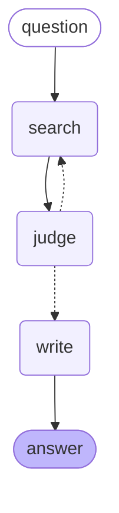

***English** · [Español](README.es.md)*

# RAG in Python — the same system, rebuilt in code

Rebuilding [my n8n RAG](https://github.com/andresjmnz92-jpg/rag-privado) as Python: the agent in
LangGraph, exposed through FastAPI and MCP, with the API-versus-local-model comparison measured.

**The first job was not to make it better. It was to make it identical.** Until the Python
retriever scores what this corpus already scores, any later comparison between the two agents
would be measuring the port instead of the agent.

**Stack:** PostgreSQL 17 + pgvector · Ollama with BGE-M3 · psycopg · `gpt-5-mini`

---

## Week 1: the retriever, ported and verified

Same 16 questions, same corpus of 581 chunks, same embedding model, same table the live n8n chat
queries. The reference numbers were measured on 10 August; the Python ones on 11 August.

| | Reference | **Python** |
| --- | --- | --- |
| Recall@10 | 16/16 | **16/16** |
| MRR@10 | 0.938 | **0.938** |
| Rank 1 | 14/16 | **14/16** |

Identical, to three decimals. The port is not a rewrite that happens to work — it retrieves the
same chunks in the same order.

**Worth being precise about what this compares.** Both numbers come from querying the same table
directly; neither goes through an n8n execution, because retrieval quality is a property of the
corpus and the embedding model, not of the tool that calls them. The n8n-versus-LangGraph
comparison is about the **agent**, and it lands in week 2.

**What that buys:** when that comparison happens, the retriever is no longer a variable.

### The whole search is one line of SQL

```sql
SELECT metadata->>'seccion' FROM documentos_v3
ORDER BY embedding <=> %s::vector LIMIT 10
```

`<=>` is pgvector's cosine distance operator. There is no vector database, no framework, and no
retrieval library involved — 25 lines of `psycopg` and `requests` replace the n8n nodes.

---

## Week 2: the agent, and a metric that was lying

The agent is two nodes and one edge: `search → write`. The five system-prompt rules are copied
from the n8n workflow word for word — changing them would turn a framework comparison into a
prompt comparison.


*That diagram is not drawn by hand: `agente.get_graph().draw_mermaid()` emits it from the compiled
graph. Documentation that cannot drift from the code is the only kind that survives.*

**One of those rules stops being a rule here.** Rule 1 tells the model to *always* search before
answering. In n8n that is a request the model is free to ignore. In a graph, `START → search →
write` means the writer cannot run without retrieved chunks. **The same instruction moves from
plea to structure**, and that difference only became visible by building both.

### The scores

20 questions, hand-verified answers, scored under the strict rule: a wrong citation is a failure
even when the content is right.

| | corpus v3 | **corpus v4** |
| --- | --- | --- |
| Cited the right section | 14/16 | **15–16/16** |
| Content correct | 14/16 | **15/16** |
| Controls (silence is correct) | 4/4 | **4/4** |
| **Total** | **17/20** | **19/20** |
| Cost of all 20 | $0.028–0.029 | **$0.027–0.030** |

**The ranges are not hedging — they are the measurement.** v4 was run twice and scored 16/16 and
15/16 on citations. Same table, same model, same prompt. Reporting a single number would have
implied a precision this does not have.

What the repeat run separates cleanly:

- **Q9 fails in every v3 run and passes in every v4 run.** That is not noise — it is the chunk
  moving from rank 63 to rank 2, and ranks are deterministic.
- **Q8 flips between runs in both corpora.** It is the only unstable question, and it is the only
  one with three expected sections; the model reaches for § 164.304 (*Definitions* of the Security
  Rule), which sits semantically next to all three.

### The finding: recall@10 was reporting 100% on a system delivering 81%

Three of the four failures had the same cause, and the metric could not see any of them.

`recall@10` asks *did the right section come back?* — and it did. What it cannot ask is whether
the chunk carrying the answer came back. A section split across 17 chunks can arrive four times
without the sentence that answers the question.

Measured, chunk by chunk:

| Question | Where the answering chunk actually ranked |
| --- | --- |
| Access deadline (§ 164.524) | **63** of 581 |
| Penalty factors (§ 160.408) | **26** — six places outside the window |
| Business associate (§ 160.103) | **151** |

The system refused to answer the access-deadline question. That was the correct behaviour: the
30-day sentence was never in front of it. **The writer was not the bottleneck; the metric was
pointing at the wrong half.**

### The rejected experiment was rejected on bad evidence

An earlier corpus version — `v4`, which prefixes every chunk with its section heading — had been
measured and **turned down**: it moved MRR from 0.938 to 0.969, "one question in sixteen", at 4%
more input tokens forever.

That decision used the section-level metric. Re-measured against the chunk that answers:

| Question | v3 | **v4** |
| --- | --- | --- |
| Access deadline | 63 | **2** |
| Penalty factors | 26 | **2** |
| Business associate | 151 | 95 — still outside |

It works for a concrete reason. The chunk holding the access deadline opens with *"(2) Timely
action by the covered entity"* — it never says "access" or "health information". Prefixed with
`§ 164.524 Access of individuals to protected health information`, the vector knows what it is
about.

**Both questions that jumped to rank 2 are the two that got fixed.** And the 4% token argument
ran backwards: v4 cost **less** overall, because a precise answer is a shorter answer.

The rejection was a sound decision made on a measurement that could not see the defect. That is
the more useful lesson than any score here: **an experiment is only as good as the metric that
judged it.**

### Who scored what

The controls score themselves — their correct answer is one exact sentence. The 16 content
judgements were made by reading each answer against the hand-verified one; Claude did the first
pass and flagged the ambiguous cases, and I decided those. Three were genuinely arguable, and one
of them I overruled. **That is not independent evaluation and the repo should not pretend it is** —
it is a faster path to the same reading, with the disagreements recorded.

---

## Week 2b: the loop, measured and rejected

A graph of two boxes and one arrow uses nothing of LangGraph — the framework exists for cycles. So
the agent grew a third node and a path that goes back: `search → judge → search`.



`judge` reads the question and the 20 chunks and returns one of two things: `SUFICIENTE`, or a
fresh search query written in the vocabulary it just read. Capped at 5 turns, the same
`maxIterations` as the n8n agent. **The writer's prompt was left untouched** — if the score moved,
it moved because of the loop.


*LangGraph Studio attached to a local server (`langgraph dev`), with LangSmith tracing off. Every
node can be opened to see what went in and what came out — the 20 chunks, the query the judge
wrote, the context the writer received.*

### The result

| | linear | **with loop** |
| --- | --- | --- |
| Content correct | 15/16 | **15/16** |
| Controls | 4/4 | **4/4** |
| **Total** | **19/20** | **19/20** |
| Seconds per query | 16.0 | **33.9** |
| Input tokens, all 20 | 77,446 | **303,099** |
| Cost of the 20 | $0.030 | **$0.081** |

Citations went from 15/16 to 16/16, and it does not count: the only one that changed is question
8, which this repo already documents as the unstable one across runs.

**The loop never turned once on the 16 questions that have an answer.** The tokens show it — each
spent about 7,400 on input, exactly two calls: judge and writer, one turn. The four controls spent
about 46,000 each, the full five turns. **61% of the spend went to the four questions whose correct
answer was to refuse.** The judge charges on all twenty and only spins the loop where there is
nothing to find.

### Why, and it is more useful than the score

The loop was designed around one specific question: number 9, which the n8n agent got right and the
linear graph got wrong. The trace showed two searches, the first teaching the second its
vocabulary. But **that was measured on corpus v3**, where the answering chunk sat at rank 63. Under
v4 it arrives at rank 2.

**Fixing the data made the architecture unnecessary.** A loop and a well-prepared corpus do not add
up; they substitute for each other. The loop compensates for bad preparation, and you keep paying
for it after the preparation is fixed.

### The threshold that did not work either

If the loop only wastes tokens on questions with no answer, the obvious move is to skip the judge
when not even the closest chunk resembles the question. Postgres already computes cosine distance
while ordering, so the signal is free. Measured across all 20:

| | distance of the closest chunk |
| --- | --- |
| 16 questions with an answer | 0.287 – **0.497** |
| 4 controls | **0.477** – 0.548 |

**They overlap.** A threshold at 0.47 would cut all four controls and also question 8, which does
have an answer: 19/20 would become 18/20. Distance measures how unusual your phrasing is, not
whether the answer is there.

### And the loop stays in the repo anyway

Not because it improves the score — it does not — but because the system this repo describes is now
the system it has. The experiment with its table is worth more than the deleted code: **a negative
result only teaches if it is published.**

---

## Running it

Postgres and Ollama run in Docker on the server and publish no ports, so an SSH tunnel reaches
them without opening anything to the internet:

```bash
ssh -i <key> -N -L 5433:<postgres-container-ip>:5432 -L 11435:<ollama-container-ip>:11434 <user>@<host>
```

Then, with `POSTGRES_USER`, `POSTGRES_PASSWORD` and `POSTGRES_DB` in a local `.env`:

```bash
python -m venv .venv && .venv/Scripts/activate
pip install "psycopg[binary]" requests python-dotenv
python recuperar.py
```

Those container IPs are assigned by Docker and change when containers restart. `docker inspect`
gives the current ones.

---

## What's next

1. **A retrieval metric that measures the chunk, not the section.** The current one reported 16/16
   while three answers were missing from what reached the model. Everything else is downstream of
   fixing that.
2. **The remaining failure, § 160.103.** Its answering chunk sits at rank 95 even under v4, and it
   opens with *"(i) On behalf of such covered entity"* — the words "business associate" appear
   nowhere in it. Retrieval alone may not reach it; returning the whole section when a chunk from
   it ranks is the obvious candidate, and it costs 4.6× the tokens, so it gets measured before it
   gets adopted.
3. **The loop against corpus v3.** If the hypothesis is that a loop compensates for bad
   preparation, running it on v3 — kept on purpose — should lift the 17/20 the linear flow scored
   there. It is the missing cell of a four-cell table.
4. **FastAPI and MCP over the same function.** Two façades, one engine.
5. **Deploy with Docker, and measure `gpt-5-mini` against a local model.** That comparison is the
   privacy argument with a number attached instead of a claim.

**Still open, and named rather than buried:** these numbers are one run each. The model is not
deterministic, and two questions out of sixteen would not survive a paired test. What carries the
argument is the mechanism — the ranks were measured before any question was re-run, and the two
questions that improved are exactly the two the ranks predicted.

**Not compared yet:** n8n against LangGraph on answer quality. The published n8n score was measured
on corpus v2, and putting it in the same table as a v3/v4 number would repeat the mistake this
week was spent finding.
